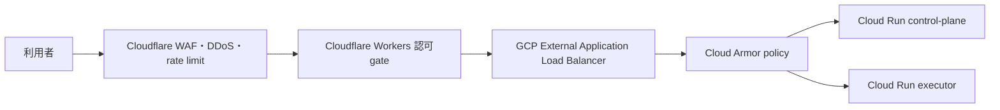

# ADR-0020: 本番の公開入口とCloud Run originを二層で保護する

| Field | Value |
|-------|-------|
| Status | proposed |
| Date | 2026-08-09 |
| Deciders | repository owner |
| Author | Codex |
| Supersedes / Superseded by | accept後、本番環境に限りADR-0012 T4の「Cloud Runを公開＋共有secret認証」を置換する。ADR-0006のWorkers gateは維持 |

## Context

RepChatの検証済み経路は、Cloudflare Workersの認可gateから、公開されたCloud Runのcontrol-planeとexecutorへ
共有secret付きHTTPSで接続する。共有secret、入力検証、tenant別IAM、Postgres RLSは不正なdata accessを拒否するが、
Cloud Runの既定`run.app` URLへ直接送られたrequestはCloudflareのWAFとrate limitを通らない。認証前のrequestでも
Cloud Runのcapacityと費用を消費し得るため、実顧客データを扱う本番では公開入口の防御とorigin迂回防止を分けて扱う
必要がある。

Google Cloud ArmorをCloud Runへ適用する公式経路は、serverless NEGをbackendとするExternal Application Load
Balancerである。Cloud Runのingressを`internal-and-cloud-load-balancing`へ制限すると、internetからのrequestを
load balancer経由に限定できる。既定URLも無効化できる。したがってload balancerの主目的はtraffic分散ではなく、
Cloud Armorの適用点とCloud Runのnetwork ingress境界を作ることである。

Cloudflareはcustom domainのincoming requestへDDoS protection、WAF managed rules、custom rules、rate limitingを
適用できる。一方、Cloudflare Workers VPCは2026-08-09時点でbetaであり、private originへ接続するにはCloudflare
Tunnelと`cloudflared`を動かすnetwork内hostが必要になる。初期3〜5社でこのbeta依存とconnector運用を本番必須に
する根拠はない。

local demoと、顧客dataを持たないowner-only demoは製品のinternet ingressではないため、本決定のmanaged WAF、
load balancer、Cloud Armorを要求しない。ただしinternet公開して実顧客dataを扱う環境は名称がdemoでも対象とする。

## Options considered

### Option 1: 現行の公開Cloud Run＋共有secretを本番でも維持する

追加費用とmigrationがなく、application認証とtenant isolationは維持できる。しかしCloudflareを迂回したrequestを
originの手前で拒否できず、availabilityとcost-abuseの防御がapplication containerへ到達した後になるため不採用とする。

### Option 2: Cloudflareの公開入口だけを強化する

custom domain、WAF、DDoS protection、rate limitingを追加し、Cloud Runは公開URLと共有secretを維持する。利用者の
通常経路は低費用で保護できるが、origin URLへの直接requestは残る。Workers VPC＋Tunnelでprivate接続する案も含むが、
2026-08-09時点ではbetaとconnector運用が本番の新しいfailure domainになるため採用しない。

### Option 3: Cloudflare edgeとGCP origin protectionを併用する

利用者requestはCloudflare WAFからWorkers gateへ通し、WorkerからExternal Application Load Balancerへ接続する。
load balancerにCloud Armorを付け、Cloud Runをload-balancing ingressだけへ制限する。二社のsecurity policy、監視、
請求を運用する負担は増えるが、既存gateとKV cacheを維持したままorigin迂回を閉じられるため採用する。

### Option 4: 現行edgeをGCPまたはAWSへ置換する

GCPだけに寄せる場合はWorkers gateとKV cacheをCloud Run等へ移し、External Application Load Balancer＋Cloud Armorを
唯一の公開入口にする。AWSではCloudFront、API Gateway、App RunnerまたはALBへAWS WAFを関連付けられる。しかし
いずれも動作済みgate、cache、IaC、監視のmigrationを伴う。AWS案は現行GCP＋Cloudflareへ第三cloudを追加するか、
BigQuery・Vertex AIを含む全面migrationになるため、独立したforcing problemが無い現時点では不採用とする。

## Decision

Option 3を提案する。repository ownerが本ADRを承認するまでinfraを作成せず、有料planを契約しない。

### D1. Cloudflareを利用者向けの唯一の公開入口にする

本番はCloudflare zone内のcustom domainを使い、`workers.dev`を利用者向け正規URLにしない。DDoS protection、
managed WAF rules、必要最小限のcustom rulesを有効にする。login、AI相談、dashboard build、report生成等の
費用または計算量が大きいendpointには、IPだけに依存せず認証済みprincipalまたはsessionを含むrate limitを設ける。
ruleは最初にlogまたはmanaged challengeで観測し、正当なAPI clientを確認後にblockへ移す。

WAFは認証・認可ではない。JWT検証、permission判定、tenant境界、RLS、BigQuery IAMを既存どおり維持する。

### D2. Cloud Runへの本番接続をExternal Application Load Balancerへ限定する

control-planeとexecutorをserverless NEG backendとしてExternal Application Load Balancerへ接続し、backend serviceへ
Cloud Armor Standard policyを付ける。Workerのorigin URLはload balancerだけを指し、`run.app` URLを参照しない。

移行確認後、Cloud Run ingressを`internal-and-cloud-load-balancing`へ変更し、既定`run.app` URLを無効化する。internet
からの直接requestがCloud Runへ届かないことをnegative testで固定する。Cloud Armorはpreconfigured WAF rules、
L7 rate limit、明らかなabuseの拒否に使う。Workerからのrequestにも既存のapplication共有secret認証を残し、
load balancerまたはCloud Armorだけをservice authenticationとして扱わない。

### D3. availabilityとcost-abuseを明示的に制限する

Cloud Runはserviceごとにmax instances、concurrency、request timeoutを設定し、Cloud Billing budget、anomaly alert、
Cloud Armor deny・rate-limit、Cloud Run 401/403/429/5xxを監視する。WAFでblockされたrequestとapplication authorizationで
拒否されたrequestを別metricとして扱い、data access incidentとavailability attackを混同しない。

### D4. local demoを対象外にする

`127.0.0.1`で動くlocal demoと、実顧客dataを持たずownerだけが使う一時demoにCloudflare WAF、Cloud Armor、load
balancerを要求しない。internet公開、第三者利用、実顧客dataのいずれかを満たす環境は、名称に関係なく本番相当として
D1〜D3を満たす。

### D5. AWSとWorkers VPCは再評価条件を満たすまで追加しない

AWS WAFはCloudFront、API Gateway、App Runner、ALB等を採用する別のcloud migrationが承認された場合だけ評価する。
現行構成のorigin防御だけを理由にAWSを第三cloudとして追加しない。

Workers VPC＋TunnelはGA、Cloud Run private ingressとのsupport path、high availability connector、Terraform管理、
障害時rollbackを実証できた場合に、GCP load balancerとCloud Armorを削減する候補として再評価する。betaの間は本番の
必須経路にしない。

## Cost baseline

2026-08-09の公式価格に基づくUSD概算で、税、為替、traffic、IP、logging、data transferは含めない。

| 項目 | 初期概算 | 根拠 |
|------|----------|------|
| External Application Load Balancer forwarding rule | `$0.025/hour`、730時間で約`$18.25/month` | Google Cloud Load Balancing pricing |
| Cloud Armor Standard security policy | 約`$5/month` | `$0.006849315/hour` |
| Cloud Armor Standard rule | 1 ruleあたり約`$1/month` | `$0.001369863/hour` |
| Cloud Armor global request | `$0.75 / 1M requests` | Google Cloud Armor pricing |
| GCP追加固定費の下限 | 約`$24.25/month` | forwarding rule＋policy＋1 rule。traffic等は別 |

Cloudflareの追加費用は、必要なmanaged rulesとrate limit機能に応じて本番投入前にplanを選ぶ。Free planでもFree
Managed Rulesetと限定的なrate limitingを利用できるが、必要機能を満たすかをsecurity testで判断し、契約は人が行う。
AWS WAFはWeb ACL、rule、requestに加えてCloudFront、ALBまたはAPI Gateway等の料金が発生するため、現行構成の
追加origin防御としては比較優位がない。

## Rollout and rollback

1. **Expand:** Terraformでload balancer、serverless NEG、Cloud Armor policyを追加する。WAF rulesはpreview/countから始める。
2. **Migrate:** Workerのoriginをload balancerへ変更し、認証、tenant isolation、cache、error mapping、実HTTP E2Eを確認する。
3. **Contract:** Cloud Run ingressを制限し、既定URLを無効化する。直接URLが失敗するnegative testを実行する。
4. **Enforce:** false positiveを確認後、Cloud ArmorとCloudflareのblocking/rate-limit rulesを段階的に有効化する。

rollbackはblocking ruleをpreviewへ戻し、load balancer経由のapplication認証を維持する。`run.app` URLの再公開はsecurity
postureを下げるため、incident時の期限付き例外として人の明示承認と記録を必要とする。安定後も旧共有secret認証は
新しいservice identity方式が別ADRで承認されるまで削除しない。

## Consequences

**Positive:**

- 通常の利用者trafficとCloud Runへの直接trafficの両方をapplication container到達前に検査できる。
- Workers gate、KV cache、tenant isolation、BigQuery IAMを作り直さずにorigin bypassを閉じられる。
- direct URL拒否をnetwork設定とnegative testで説明でき、顧客向けsecurity説明が具体化する。

**Negative:**

- CloudflareとGCPの二つのWAF policy、log、alert、請求を運用する。
- 低trafficでもGCP側に月約`$24.25`以上の追加固定費が発生する。
- 二層のrate limitまたはmanaged ruleが正当なrequestを重複して拒否する可能性があり、previewとcorrelation IDが必要になる。
- load balancer、NEG、certificate、DNS、Cloud ArmorをTerraformとrunbookへ追加する実装工数が発生する。

**Follow-ups:**

- 本ADRをrepository ownerが承認、修正または却下する。
- Issue #160が`proceed`となり、実顧客dataを扱う本番環境の構築直前にimplementation Issueを作る。
- implementationではsecurity-property test、`make security-scan`、費用見積り、Terraform planの人間reviewを必須にする。
- 本番role・authenticationを決めるIssue #194と、service-to-service identityの将来判断を混ぜない。

## References

- [ADR-0005](0005-cache-and-authorization-architecture.md)
- [ADR-0006](0006-edge-gate-runtime-cloudflare-workers.md)
- [ADR-0010](0010-connection-identity-is-never-a-person.md)
- [ADR-0012](0012-terraform-cloud-run-deployment.md)
- [Issue #302](https://github.com/Yukihide-Mitsuoka/repchat/issues/302)
- Google Cloud: [Cloud Run ingress](https://docs.cloud.google.com/run/docs/securing/ingress)、
  [Cloud Armor with Cloud Run](https://docs.cloud.google.com/armor/docs/integrating-cloud-armor)、
  [Cloud Armor pricing](https://cloud.google.com/armor/pricing)、
  [Load Balancing pricing](https://cloud.google.com/load-balancing/pricing)
- Cloudflare: [WAF](https://developers.cloudflare.com/waf/)、
  [security execution order](https://developers.cloudflare.com/waf/feature-interoperability/)、
  [Workers custom domains](https://developers.cloudflare.com/workers/configuration/routing/custom-domains/)、
  [Workers VPC](https://developers.cloudflare.com/workers-vpc/)
- AWS: [WAF protected resources](https://docs.aws.amazon.com/waf/latest/developerguide/how-aws-waf-works-resources.html)、
  [WAF pricing](https://aws.amazon.com/waf/pricing/)
