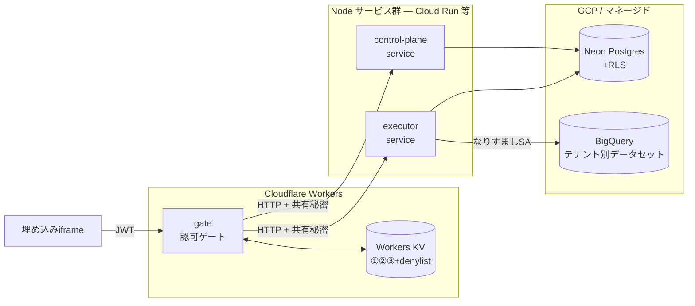

# デプロイ Runbook

本番トポロジの構成・設定・手順。コードは完成しており（[status.md](status.md) §3）、残るのは
この文書に沿った**デプロイと設定**です。設計の背景は
[ADR-0005](adr/0005-cache-and-authorization-architecture.md)（キャッシュ×認可）・
[ADR-0006](adr/0006-edge-gate-runtime-cloudflare-workers.md)（エッジ＝Workers）・
[ADR-0010](adr/0010-connection-identity-is-never-a-person.md)（D1接続主体）。

> **秘密情報は絶対にリポジトリへ置かない（GR-001）。** すべてのトークン・接続文字列・パスワードは
> デプロイ先のシークレット機構（`wrangler secret` / Secret Manager 等）に置く。ローカルは
> gitignore された `.env` のみ。この文書には**変数名だけ**を書く。

## 1. トポロジ



- **gate**（Cloudflare Workers）: JWT検証・認可・①②③キャッシュ。Node専用ドライバを使えないので
  control-plane / executor へは**HTTP越し**に到達する（#65・#99）。
- **control-plane service**（Node）: `createControlPlaneHandler` ＋ Postgres アダプタ。
  合成ルート `src/main/control-plane-server.ts`。
- **executor service**（Node）: `createExecutorHandler` ＋ BigQuery ＋ D1なりすまし。
  合成ルート `src/main/executor-server.ts`。
- **Neon**（マネージドPostgres）: 管理データ＋RLS。**BigQuery**: 分析データ。

## 2. サービス別の設定

`必須`列が✓のものは未設定だと起動失敗（exit 2）。`秘密`列が✓のものはシークレット機構に置く。

### gate（`wrangler.toml` の vars / secrets ＋ KV バインディング）

| 変数 | 必須 | 秘密 | 説明 |
|---|---|---|---|
| `RESULT_KV` `AUTHZ_KV` `DENYLIST_KV` `SHELL_KV` | ✓ | | KV名前空間（②/③/denylist/①）。`wrangler kv namespace create` で作成しidを貼る |
| `GATE_AUDIENCE` | ✓ | | 期待するJWTの `aud` |
| `VENDOR_KEYS` | ✓ | | `{ "<kid>": <public-JWK> }`。公開鍵なので非秘密だが環境ごとに設定。本番はcontrol-planeの `vendor_keys` 由来 |
| `CONTROL_PLANE_URL` / `CONTROL_PLANE_TOKEN` | ✓(本番) | TOKENのみ✓ | 未設定ならインメモリfixtureにフォールバック。両方揃って初めてHTTP経由 |
| `EXECUTOR_URL` / `EXECUTOR_TOKEN` | ✓(本番) | TOKENのみ✓ | 同上（executorサービス） |

### control-plane service（`process.env`）

| 変数 | 必須 | 秘密 | 既定 | 説明 |
|---|---|---|---|---|
| `DATABASE_URL` | ✓ | ✓ | | Neon接続文字列。サービスはユーザーを `app_runtime` に上書きして接続する |
| `APP_RUNTIME_PASSWORD` | ✓ | ✓ | | `app_runtime` ロールのログインパスワード（≥16文字） |
| `CONTROL_PLANE_TOKEN` | ✓ | ✓ | | gate と共有する秘密。gateの `CONTROL_PLANE_TOKEN` と一致させる |
| `PORT` | | | `8788` | 待受ポート |

### executor service（`process.env`）

| 変数 | 必須 | 秘密 | 既定 | 説明 |
|---|---|---|---|---|
| `DATABASE_URL` | ✓ | ✓ | | 上と同じ（`PgBindingResolver` が使用） |
| `APP_RUNTIME_PASSWORD` | ✓ | ✓ | | 上と同じ |
| `EXECUTOR_TOKEN` | ✓ | ✓ | | gate と共有する秘密。gateの `EXECUTOR_TOKEN` と一致させる |
| `QUERY_POLICY` | | | `{"tables":[]}` | テーブル許可リスト(JSON)。**未設定/不正なら全クエリ拒否＝fail-closed**（LOG-0039） |
| `PORT` | | | `8787` | 待受ポート |
| BigQuery資格情報 | ✓ | — | | ADC 経由（デプロイ先の**アタッチSA**、ローカルは `gcloud auth application-default login`）。`AdcTokenProvider` が読む |

各サービスは `GET /health` → `ok` を返す（ロードバランサ/Cloud Run のヘルスチェック用）。

## 3. デプロイ手順（順序が重要）

1. **Neon をプロビジョン**し、オーナーの接続文字列を得る（→ `DATABASE_URL`）。
2. **共有秘密を生成**（各サービスごとに別々に）:
   ```bash
   openssl rand -base64 32   # CONTROL_PLANE_TOKEN 用
   openssl rand -base64 32   # EXECUTOR_TOKEN 用
   openssl rand -base64 24   # APP_RUNTIME_PASSWORD 用（[A-Za-z0-9_-] のみ）
   ```
3. **マイグレーション適用**（`app_runtime` の LOGIN 有効化も含む）:
   ```bash
   npm run migrate         # DATABASE_URL と APP_RUNTIME_PASSWORD を環境に置いて実行
   npm run migrate:verify
   ```
4. **control-plane service をデプロイ**（例: Cloud Run）。上表の変数をシークレットとして設定。
5. **executor service をデプロイ**。`QUERY_POLICY` を実テーブルに合わせて設定し、
   実行 SA に BigQuery アクセスを付与（D1: `spikes/executor-d1-backstop/README.md` の手順で
   テナント別SA作成＋`connection_ref` 投入）。
6. **gate をデプロイ**（Cloudflare）:
   ```bash
   npx wrangler kv namespace create RESULT_KV     # AUTHZ_KV / DENYLIST_KV / SHELL_KV も
   npx wrangler secret put CONTROL_PLANE_TOKEN     # EXECUTOR_TOKEN も
   npx wrangler deploy
   ```
   `CONTROL_PLANE_URL` / `EXECUTOR_URL` を手順4/5のサービスURLに設定。
7. **スモーク**: 各サービスの `GET /health`、続いて gate 経由で1レポートを取得し越境ゼロを確認。

## 4. ローカル開発

`.env`（gitignore済み）に変数を置き、3プロセスを並行起動:

```bash
npm run serve:control-plane   # :8788
npm run serve:executor        # :8787
npx wrangler dev              # gate。CONTROL_PLANE_URL=http://localhost:8788 等を wrangler の [vars] に
```

`CONTROL_PLANE_URL` / `EXECUTOR_URL` を未設定にすれば、gate はインメモリfixtureで単体起動できる
（サービス無しで `wrangler dev` を触るとき）。

## 5. シークレット運用（GR-001）

- **保管**: `wrangler secret put`（gate）、Secret Manager → Cloud Run `--set-secrets`（Nodeサービス）。
- **ローテーション**: 共有秘密は gate と対応サービスで**同時に**更新する（不一致は 401→gateで500に写像）。
- **`connection_ref` は非機密**（なりすまし対象のSAメール）。資格情報そのものは保存しない（D1はIAMの
  短命トークンを都度発行＝鍵不保存）。
- **`vendor_keys` は公開鍵のみ**。

## 参照

- 実装状況と残タスク: [status.md](status.md)
- D1 のライブ検証とSAセットアップ: `spikes/executor-d1-backstop/README.md`
- マイグレーション: [migrations/README.md](../migrations/README.md)
