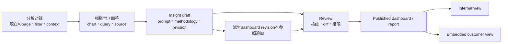

# 要件定義 — 分析ワークスペースUI

この文書は、ChatGPT系デスクトップUIを参考にしながら、RepChatの分析相談、ダッシュボード閲覧、
SQL来歴確認、会議報告を一つの再現可能なワークスペースへ配置する製品要件を定義します。
[Issue #179](https://github.com/Yukihide-Mitsuoka/repchat/issues/179)の情報設計成果を所有し、
ローカルデモの現状説明は[デモ手順](../demo.md)を正本とします。

## 1. 用語

| 用語 | 定義 |
|------|------|
| 分析ワークスペース | 一つの利用企業・認可scope内で、分析対話、ダッシュボード、会議報告、来歴を扱うUI上の作業単位 |
| 左ナビゲーション | ワークスペース、成果物、分析履歴、アカウント導線を持つ主選択領域 |
| メインサーフェス | 現在選択したダッシュボード、分析対話、会議報告、単一グラフを表示する主作業領域 |
| 右セカンダリpane | `Inspector`または`Artifact Preview`の一方を表示する右領域。同時に二つは表示しない |
| インスペクター | 選択中のパネルに従属する理由、定義・検証、SQL、取得データ、来歴を表示する右側の二次領域 |
| アーティファクトプレビュー | 対話を中央に残したまま、生成中または保存前のInsight、dashboard、reportを確認する右側の成果物領域 |
| パネル | KPI、グラフ、表の一つと、そのSQL・定義・検証・revisionを結び付けた成果物 |
| 分析スレッド | 一つの分析目的について、質問、回答、分析仕様revision、buildを結ぶ対話単位 |
| インサイト | 一つの質問への回答、可視化、query、source、filter、prompt、実装メモを固定revisionとして保存した再利用可能な成果物 |
| 分析コレクション | 関連するダッシュボードと分析スレッドを整理する利用者向けディレクトリ。GCP projectやtenantではない |
| push | 左右領域がメインサーフェスの幅を縮めて同じgrid内へ表示される配置 |
| overlay | 左右領域がメインサーフェスの上へ重なり、背後の操作を一時的に制限する配置 |
| 出典区分 | `Official`、`Observed`、`Owner intent`、`RepChat decision`のいずれか。外部製品の事実と本製品の判断を分離する |

## 2. 前提と制約

| ID | 種別 | 内容 | 誤っていた場合の影響 |
|----|------|------|----------------------|
| A-1 | 前提 | 初期利用者は、複数顧客へ分析を提供する日本の小規模代理店・ソフトウェアベンダーの担当者である | 左ナビゲーションの顧客・分析整理単位を再設計する |
| A-2 | 前提 | 利用者はダッシュボード閲覧を最頻操作とし、SQL編集より先に結論と根拠を確認する | メインサーフェスの既定画面を再評価する |
| A-3 | 前提 | デスクトップまたは横長Webが編集者の主端末で、モバイルは閲覧・確認が中心である | モバイル編集要件を別途追加する |
| C-1 | 制約 | ChatGPT／Evidenceの商標、文章、アイコン、非公開design token、DOM/CSSを複製しない。公開情報から得た情報構造だけを参考にする | ブランド混同と継続的な追随負債を避ける |
| C-2 | 制約 | テナント、分析コレクション、GCP project、顧客Git repositoryを同一概念として扱わない | 認可境界と保存先の混同を防ぐ |
| C-3 | 制約 | SQL、取得データ、来歴は権限を持つ利用者だけへ表示する | Issue #179の認可要件を守る |
| C-4 | 制約 | Issue #160が`proceed`になるまで、この文書を根拠に製品UIを先行実装しない | デモ検証前の過剰実装を防ぐ |
| C-5 | 制約 | 永続履歴、Git branch操作、アカウント設定をローカルデモで実装済みと表示しない | デモ能力と製品要件を区別する |

## 3. 目的と範囲

- **目的:** 利用者が分析の整理、相談、成果閲覧、根拠確認、会議報告を、選択文脈を失わずに行える
  一貫したデスクトップワークスペースを定義する。
- **成功指標:**

  | 指標 | 目標 | 測定方法 |
  |------|------|----------|
  | グラフから対応SQLへ到達 | 初見利用者の80%以上が10秒以内、2操作以内 | 5名以上のタスクテスト |
  | 主要操作の発見 | 初見利用者の80%以上が、新しい分析、既存ダッシュボード、会議報告を各20秒以内に発見 | 5名以上のタスクテスト |
  | 文脈保持 | インスペクターを開閉しても選択パネル、スクロール位置、表示revisionが100%維持される | 自動E2Eとvisual regression |
  | 会話文脈の透明性 | AIへ送る前に、利用企業、成果物revision、filter、選択panel、追加contextを100%確認・解除できる | context contract E2E |
  | 回答の再利用 | 根拠付き回答を再queryせず3操作以内でインサイトとして保存し、派生ダッシュボードへ追加できる | user task＋revision E2E |
  | レイアウト安定性 | 対象viewportと左右状態の全組合せで、主見出しが縦書き化せず、横方向の意図しないoverflowが0件 | §8の状態行列を自動撮影 |
  | キーボード操作 | 開閉、移動、リサイズ、タブ切替、復帰をマウスなしで完了 | アクセシビリティE2E |

- **対象:** app shell、左ナビゲーション、メインサーフェス、右セカンダリpane、overlay、状態、responsive、
  keyboard、deep link、可視context、Insight／publish lifecycle、embedded preview、RepChat機能との対応。
- **対象外:** 本番認証方式、課金区分、永続対話DB、GitHub App実装、自由SQL editor、AI生成品質、
  ChatGPTのpixel-perfect複製。
- **関係者:**

  | 役割 | 関心 | 決定権 |
  |------|------|--------|
  | リポジトリオーナー | 製品方針、優先順位、UI受入 | 最終承認 |
  | 分析編集者 | 相談、build、SQL・来歴確認 | 操作性の評価 |
  | 閲覧者 | ダッシュボードと承認済み報告の閲覧 | 閲覧性の評価 |
  | 管理者 | 利用者、データソース、Git接続 | 設定・権限境界の評価 |

## 4. 調査根拠

### 4.1 出典台帳

| ID | 区分 | 確認した内容 | URL |
|----|------|--------------|-----|
| SRC-01 | Official | デスクトップshellは永続sidebar、安定したdetail、二次情報用inspector、toolbar、shortcut、独立Settingsに責務分離する | [Build a Mac app shell](https://learn.chatgpt.com/use-cases/macos-sidebar-detail-inspector) |
| SRC-02 | Official | dashboardはchartからではなく意思決定、KPI階層、定義、品質検査、owner、監視、公開riskから設計する | [Plan a dashboard and monitoring workflow](https://learn.chatgpt.com/use-cases/dashboard-builder-monitor) |
| SRC-03 | Official | 曖昧な分析依頼は、business question、定義、source、join、期間、読者を確認した分析契約へ変換する | [Scope an analytics request](https://learn.chatgpt.com/use-cases/analytics-request-agent) |
| SRC-04 | Official | KPI変動の説明では確定driver、仮説、反証、品質制約、source link、次の確認を分離する | [Analyze KPI root causes](https://learn.chatgpt.com/use-cases/kpi-root-cause-analysis) |
| SRC-05 | Official | business reviewはKPI、定義、過去報告、owner noteを使い、重要数値をsourceへ結び付けて未支持主張を除外する | [Prepare a business review](https://learn.chatgpt.com/use-cases/monthly-business-review-narrative) |
| SRC-06 | Observed | 公開・未ログインのChatGPT日本語画面に、sidebar開閉、新しいチャット、チャット検索、画像、Plugins、Deep Research、設定、Help、composerが存在する | [ChatGPT公開画面](https://chatgpt.com/) |
| SRC-07 | Owner intent | 左右paneの開閉・drag、左上の検索・menu、中段のproject・履歴、左下のaccount・settings、中央との重なりを要件化する | この依頼 |
| SRC-08 | RepChat decision | 現行デモは左右pane、4 workspace、panel inspector、費用確認を実装済み。製品要件は現行コードから独立して理想を定義する | [Issue #328](https://github.com/Yukihide-Mitsuoka/repchat/issues/328)、[PR #330](https://github.com/Yukihide-Mitsuoka/repchat/pull/330) |
| SRC-09 | Official competitor | Evidence Analytics Agentは、現在のpageとfilterを文脈にし、回答へchart、query、sourceを結び付ける。回答をpromptと実装メモ付きInsightへ保存し、維持管理するpageへ昇格できると説明する | [Analytics Agent](https://evidence.dev/product/analytics-agent) |
| SRC-10 | Official competitor | Evidence Internal Analyticsは、SQL／Markdown、version control、test、review-before-publish、page access、row-level securityを中心とし、自由なdrag-and-dropを採らないと説明する | [Internal Analytics](https://evidence.dev/product/internal-reporting) |
| SRC-11 | Official competitor | Evidence Embedded Analyticsは、themeの即時preview、API＋iframe、single-use URL、session length、database RLS、multi-languageを顧客向け配信面として説明する | [Embedded Analytics](https://evidence.dev/product/embedded-analytics) |

### 4.2 証拠の扱い

- `Official`はOpenAI公式資料が説明する責務やworkflowだけを根拠にする。ChatGPT固有の寸法とは扱わない。
- `Observed`はURL、locale、認証状態、観測日を固定する。SRC-06は日本語、未ログイン、2026-08-10のDOM観測である。
- `Owner intent`は製品要望であり、外部製品の事実として引用しない。
- `Official competitor`は競合自身の製品説明であり、性能やsecurityをRepChatが実測した証拠とは扱わない。
- 寸法、breakpoint、motion、menu順はすべて`RepChat decision`として以下に固定する。

## 5. 機能マッピング

| 参照UI／workflow | RepChatの責務 | 現在のデモ | 製品要件 |
|------------------|---------------|------------|----------|
| New chat | 新しい分析スレッドを作る | 既定設問の再入力 | NAV-002、MAIN-002 |
| Search chats | 認可scope内のダッシュボード・分析スレッドを検索 | 未実装 | NAV-003 |
| Projects | 顧客別または目的別の分析コレクション | 将来機能の文言だけ | NAV-005。tenantとは分離 |
| Chat history | 分析スレッドと分析仕様revisionの履歴 | 起動中の固定表示だけ | NAV-006 |
| Center conversation | AIと目的、KPI、比較、読者、panel候補を相談 | 作成・編集view | MAIN-002、Issue #180 |
| Artifact/detail | 完成ダッシュボードまたは会議報告を主表示 | dashboard/report view | MAIN-001、MAIN-003 |
| Inspector | 選択panelの理由、定義、SQL、data、lineage | 理由、SQL、data、来歴の4タブ | INS-001〜INS-007 |
| Settings | account、表示、data source、members、Git接続 | 未実装 | NAV-008、OVR-003 |
| Dashboard planning | 意思決定からKPI階層とpanel構成を決める | 最大6panelの対話prototype | MAIN-002、SRC-02 |
| Analytics request scoping | 曖昧さを確認してanalysis specificationをfreezeする | 確認事項とrevisionを表示 | MAIN-002、SRC-03 |
| KPI root-cause brief | 観測、解釈、仮説、反証、次の検証を分ける | 会議報告prototypeの一部 | MAIN-003、SRC-04 |
| Business review | 根拠付き会議報告とowner action | 未承認案を生成 | MAIN-003、SRC-05、Issue #181 |

### 5.1 Evidenceとの機能対応

| Evidence公式ページ上の責務 | RepChatで採用する責務 | 採用しない短絡 | 製品要件 |
|----------------------------|------------------------|----------------|----------|
| Search／Chat／Insights | 検索、分析対話、保存済みインサイトを別の情報型としてナビゲーションする | 単一グラフ検証画面を製品の主ナビへ残す | NAV-004、NAV-011 |
| 現在pageとfilterをagentが理解 | 利用企業、成果物revision、filter、選択panel、追加contextを送信前にchipで明示する | 画面上で見えない文脈を自動送信する | MAIN-009、INS-011 |
| chart、query、source付きquick answer | 回答本文、最小可視化、根拠linkを同じ回答cardへ置き、SQLは権限付きinspectorで開く | 全利用者へSQLを常時露出する | MAIN-010、INS-005 |
| Save as Insight | prompt、methodology、filter、query／result revisionを不変なInsight revisionへ保存する | 生の会話全体をそのまま正式成果物にする | MAIN-011、OVR-006 |
| Insightをpageへ昇格 | 元Insightを変更せず、派生dashboard revisionから参照する | AI生成原本の上書きや無断再query | MAIN-012、Issue #308 |
| Custom context／skills | 適用中contextと分析手順をscope付きchipとして表示し、利用者が確認・解除する | 全memoryを毎回promptへ投入する | MAIN-013、ADR-0018 |
| Version control／review／publish | draft、review、preview、published、supersededを成果物statusとして分離する | 編集中revisionの即時公開 | MAIN-014、OVR-007 |
| Code-first、no drag-and-drop | AI対話と構造化panel compositionを主経路にし、自由配置editorを初期範囲にしない | 汎用BI canvasの先行実装 | MAIN-016、Issue #308 |
| Embedded delivery | authoringから分離した顧客preview／配信modeでbrand、locale、identity、expiryを確認する | iframe URLを通常dashboard共有linkとして流用する | MAIN-015、OVR-008 |
| Slack／MCP | Web成果物revisionを正本とし、他channelは同じ認可・来歴へ接続するadapterとする | channelごとの独立成果物 | INS-010、ADR-0017 |

## 6. UIインベントリと機能要件

機能要件IDはUI領域ごとのnamespace（`APP-*`、`NAV-*`、`MAIN-*`、`INS-*`、`OVR-*`）を使い、
この文書内で変更せずに維持します。非機能要件は`NFR-*`、受入条件は`AC-*`で識別します。

### 6.1 App shell

| ID | 要件 | 目的 | 優先度 | 根拠 |
|----|------|------|--------|------|
| APP-001 | app shellは`AppHeader`、`PrimaryNavigationPane`、`MainSurface`、`SecondaryPane`、`OverlayHost`の5領域を持つ | 文脈保持 | Must | SRC-01 |
| APP-002 | headerは高さ52pxでstickyとし、左にsidebar toggleと製品名、中央に組織／分析コレクション／成果物breadcrumb、右に状態・共有／公開・secondary pane toggleを置く | 発見性 | Must | RepChat decision |
| APP-003 | 左右paneがpush状態でも`MainSurface`をDOM上の明示的な中央grid列に保ち、閉じたpaneは0pxにする | レイアウト安定性 | Must | PR #332 |
| APP-004 | route、選択panel、表示revisionをURLで表現し、再読込、back、forward、共有linkで復元する | 文脈保持 | Must | Issue #179 |
| APP-005 | viewer、editor、adminで利用不能な機能は、存在を隠すか理由付きdisabledにする。クリック後に権限エラーを初めて出さない | 安全性 | Must | C-3 |
| APP-006 | `SecondaryPane`は`Inspector`と`Artifact Preview`を切り替える。同時表示や入れ子paneを禁止し、切替後も中央の会話またはdashboardのscroll位置を維持する | 情報密度 | Must | SRC-01、SRC-09 |

推奨component treeを実装契約とします。

```text
AppShell
├── AppHeader
│   ├── PrimaryNavigationToggle
│   ├── WorkspaceBreadcrumb
│   ├── ArtifactStatus
│   └── InspectorToggle
├── PrimaryNavigationPane
│   ├── NavigationHeader
│   ├── PrimaryActions
│   ├── Collections
│   ├── RecentAnalysisThreads
│   └── AccountControl
├── MainSurface
│   └── Dashboard | AnalysisConversation | Insight | MeetingReport | SingleChart | PublishPreview
├── SecondaryPane
│   ├── InspectorPane
│   │   └── Reason | Definition | SQL | Data | Provenance | Methodology
│   └── ArtifactPreview
│       └── Insight | Dashboard | MeetingReport | PublishPreview
└── OverlayHost
    └── Search | AccountMenu | SaveInsight | Publish | CustomerPreview | Settings | CostConfirm | ConfirmDialog | Tooltip
```

### 6.2 左ナビゲーション

| ID | 要件 | 優先度 |
|----|------|--------|
| NAV-001 | 左paneはdesktopで既定220px、最小180px、最大360pxとし、開閉とdrag resizeを提供する | Must |
| NAV-002 | 固定上部に「新しい分析」を置き、選択中の利用企業・認可scopeを引き継いだ空の分析スレッドを作る | Must |
| NAV-003 | 固定上部に検索を置き、許可されたダッシュボード、インサイト、会議報告、分析スレッドのtitleとmetadataだけを検索する。SQL本文、結果値、非公開prompt本文、他tenantは検索対象外とする | Must |
| NAV-004 | 製品の主ナビゲーションを「ダッシュボード」「分析対話」「インサイト」「会議報告」の順にする。単一グラフはデモ／検証routeへ限定し、製品の主ナビへ置かない | Must |
| NAV-005 | 中央scroll領域に分析コレクションを表示し、展開時に配下のダッシュボード、インサイト、会議報告、分析スレッドを種別ごとに表示する | Should |
| NAV-006 | 分析履歴は更新日時の降順で「固定」「今日」「過去7日」「それ以前」に分け、空状態と読込中を表示する | Should |
| NAV-007 | 中央領域だけをscrollし、「新しい分析／検索」と最下部account controlは常時表示する | Must |
| NAV-008 | 最下部account controlはavatar、表示名、利用企業を1行で示し、menuを「プロフィール」「設定」「Help」「ログアウト」の順に開く | Should |
| NAV-009 | dashboard／insight／report／threadのoverflow menuは「開く」「名前変更」「固定／固定解除」「複製またはfork」「linkをコピー」「archive」を順に示す。権限やstatusで利用不能な項目は理由付きdisabledにし、削除はseparator後の最後に置き確認dialogを必須にする | Should |
| NAV-010 | sidebarを閉じたdesktop状態ではpaneを0pxにし、headerのtoggleだけを残す。icon railは作らない | Must |
| NAV-011 | 分析スレッドと保存済みインサイトを混在させず、インサイトにはdraft／review／published、更新日時、参照先dashboardのstatusを表示する | Must |

### 6.3 メインサーフェス

| ID | 要件 | 優先度 |
|----|------|--------|
| MAIN-001 | 既定routeは完成または直近成功revisionのダッシュボードとし、未生成時は作成・編集への単一primary actionを示す | Must |
| MAIN-002 | 作成・編集は、分析目的、AI対話、推奨回答、KPI・panel候補、仕様revision、費用確認、build progressを一つの分析スレッドとして表示する | Must |
| MAIN-003 | 会議報告は、要約、観測、解釈、仮説、反証または不足情報、owner付きaction、根拠link、承認状態を表示する | Must |
| MAIN-004 | 単一グラフは、任意設問の検証経路としてダッシュボード生成から独立して残すが、通常利用のprimary navigationには昇格させない | Should |
| MAIN-005 | ダッシュボードはgraphと必要なtableを主表示し、SQLを常時展開しない。panel選択でINS-001を開く | Must |
| MAIN-006 | build中に別routeへ移動してもjob状態を失わず、左navとheaderに実行中表示を残す | Must |
| MAIN-007 | AI対話composerは作成・編集の下端へsticky配置し、送信、停止、添付、費用が発生する操作の区別を明示する | Should |
| MAIN-008 | 空、読込、streaming、確認待ち、費用確認待ち、build中、部分成功、成功、停止、error、要承認、公開済みを別状態として表示する | Must |
| MAIN-009 | AI対話のheaderまたはcomposer直上に、利用企業、data source、成果物revision、適用filter、選択panel、追加context／skillをchipで表示する。利用者は任意chipを送信前に解除でき、必須scopeはlock iconと理由を示す | Must |
| MAIN-010 | quick answerは「回答」「最小可視化またはtable」「根拠を確認」「インサイトとして保存」「続けて質問」を一つのcardへ置く。数値claimはresult／panel revisionへ結び付け、SQLはpermissionがある場合だけinspectorで開く | Must |
| MAIN-011 | 「インサイトとして保存」はBigQueryを再実行せず、質問、回答、可視化、query／result revision、filter、prompt、methodology、作成者を一つの不変revisionとして保存する | Must |
| MAIN-012 | 保存済みインサイトの「ダッシュボードへ追加」は元revisionを変更せず、対象dashboardの派生revisionに参照を追加する。対象、配置候補、権限差分を確認してから作成する | Should |
| MAIN-013 | 組織context、部門context、利用者context、分析skillは適用中のscopeと由来を表示し、対話ごとに追加／除外できる。自動継承された内容を不可視のまま送信しない | Must |
| MAIN-014 | dashboard、insight、reportは`draft`→`review`→`published`→`superseded`のstatusを持ち、previewは公開予定の固定revision、公開後の既定閲覧はpublished revisionを表示する | Must |
| MAIN-015 | embedded customer previewは通常のauthoring routeと分離し、brand、locale、viewport、authorized customer identity、session expiryをtoolbarで確認する。identity切替はadminだけに許可し、server発行preview sessionを必須にする | Should |
| MAIN-016 | 初期authoringはAI対話、構造化template、panel参照追加、順序変更に限定し、任意座標drag-and-drop、任意HTML／code、自由layout canvasを提供しない | Must |

### 6.4 右セカンダリpane

| ID | 要件 | 優先度 |
|----|------|--------|
| INS-001 | panelの「詳細を確認」または選択操作で開き、panel title、purpose、revisionをheaderに固定する | Must |
| INS-002 | desktopで既定330px、最小280px、最大560pxとし、開閉とdrag resizeを提供する | Must |
| INS-003 | Inspectorのタブ順を「理由」「定義・検証」「SQL」「データ」「方法」「来歴」とする | Must |
| INS-004 | 初回は「理由」を開き、同一panelへ戻った場合はsession中の最後のタブを復元する | Should |
| INS-005 | SQLタブは権限がある利用者だけに表示し、整形済みSQL、copy、query hash、実行／単独再現用の区別を示す | Must |
| INS-006 | データタブは描画へ渡した列と行、件数、truncate状態、result revisionを示す。raw source全体を暗黙に表示しない | Must |
| INS-007 | 来歴タブはanalysis specification、panel、result、dashboard、build、publishのrevision chainと検証状態を表示する | Must |
| INS-008 | panelを切り替えてもメインのscroll位置を変えず、選択中panelへ明示的なfocus／borderを付ける | Must |
| INS-009 | inspectorを閉じても選択panelを維持し、再度開いたときに同じpanelとタブへ戻す | Must |
| INS-010 | 「方法」に質問、確認済みanalysis specification、適用context／skill、生成／利用者編集を表示し、「来歴」に起点channel、検証、保存、昇格、公開のevent chainを表示する | Must |
| INS-011 | 現在の成果物revision、filter、parameter、data scopeと、AIへ渡す値／渡さない値を表示する。filter変更後は古い回答へ「以前のfilter」badgeを付ける | Must |
| INS-012 | quick answer生成時は`Artifact Preview`へ成果物を表示し、headerに種類、draft状態、revision、保存、閉じるを置く。保存前でも中央の対話とfollow-up composerを操作できる | Must |
| INS-013 | `Artifact Preview`の「このInsightについて質問」は、Insight revisionを明示的なcontext chipとしてcomposerへ追加し、元の分析スレッドにfollow-upを作る | Should |

### 6.5 Overlayと設定

| ID | 要件 | 優先度 |
|----|------|--------|
| OVR-001 | search、account menu、context menu、tooltip、費用確認、破壊操作確認を`OverlayHost`で管理し、pane gridの幅計算へ含めない | Must |
| OVR-002 | 費用が発生する操作は、対象処理、Vertex AI見積、BigQuery上限、合計、cancel、実行をmodal dialogに表示する | Must |
| OVR-003 | Settingsは主作業stack内の擬似pageにせず独立dialogまたは専用routeとし、「一般」「表示」「データソース」「メンバーと権限」「Git連携」をpermissionに応じて表示する | Should |
| OVR-004 | tooltipはpointer hoverまたはkeyboard focusの500ms後に表示し、Escape、blur、pointer leaveで閉じる | Could |
| OVR-005 | modal／drawerはfocus trap、初期focus、Escape、閉じた後のfocus復帰を実装する | Must |
| OVR-006 | Insight保存dialogは名前、説明、分析コレクション、共有範囲、保存対象revisionを示し、既定で`draft`として保存する。保存だけではpublishしない | Must |
| OVR-007 | publish dialogは対象revision、変更概要、検証結果、権限差分、公開先、rollback先を示し、review未完了または検証失敗をfail closedにする | Must |
| OVR-008 | customer previewの起動dialogはcustomer identity、brand、locale、有効期限を示し、preview URLを通常共有linkとしてcopyできないよう区別する | Should |

### 6.6 会話から配信までの成果物ライフサイクル



- 対話は探索の履歴、Insightは再利用可能な固定成果物、dashboard／reportはレビュー済みの構成物とし、
  同一entityへ押し込まない。
- 「保存」はdraft作成、「追加」は派生revision作成、「公開」はreview済みrevisionの切替であり、
  それぞれ別操作・別permission・別audit eventとする。
- Internal viewとEmbedded customer viewは同じpublished revisionを参照できるが、identity、theme、locale、
  session契約を共有しない。

### 6.7 surface mode別の配置

| mode | 左ナビゲーション | メインサーフェス | 右セカンダリpane | primary action |
|------|------------------|------------------|----------------------|----------------|
| Dashboard閲覧 | dashboard／collection選択 | published dashboard | 選択panelのInspector | 共有または会議報告へ |
| 分析対話 | thread／Insight履歴 | 会話、context bar、sticky composer | 生成中回答のArtifact Preview。必要時はInspectorへ切替 | 仕様確認またはInsight保存 |
| Insight閲覧 | Insight選択 | 保存済みInsightの回答と可視化 | methodology／SQL／data／来歴Inspector | ダッシュボードへ追加 |
| 会議報告 | report選択 | report本文、決定、action | 根拠panel／来歴Inspector | reviewまたはpublish |
| Publish preview | artifact選択 | 公開予定の固定revision | diff、検証、権限、公開先 | publish |
| Embedded preview | artifact選択 | customer viewの固定revision | brand、locale、identity、expiry | preview終了 |

desktopの分析対話では中央を会話、右をArtifact Previewとし、回答cardを縦方向に二重表示しません。
tablet以下ではArtifact Previewをoverlay／全幅sheetへ変え、閉じると同じ会話位置へ戻します。

## 7. レイアウトとvisual contract

以下はChatGPTの測定値ではなくRepChat固有の実装値です。

### 7.1 寸法

| token | 値 | 適用 |
|-------|----|------|
| `header-height` | 52px | 全desktop／tablet |
| `nav-width-default` | 220px | 1181px以上 |
| `nav-width-min` / `max` | 180px / 360px | drag範囲 |
| `inspector-width-default` | 330px | 1181px以上 |
| `inspector-width-min` / `max` | 280px / 560px | drag範囲 |
| `artifact-preview-width-default` | 480px | 1181px以上の分析対話 |
| `artifact-preview-width-min` / `max` | 420px / 720px | drag範囲。中央min-widthを侵害する場合はoverlayへ切替 |
| `splitter-track` | 6px | pointer hit領域とfocus領域 |
| `resize-key-step` | 20px | 左右矢印1回 |
| `main-padding` | 上下24px、左右28px、下72px | desktop |
| `mobile-main-padding` | 上下20px、左右16px、下48px | 760px以下 |
| `panel-gap` | 16px | dashboard grid |
| `control-height` | 最小34px | headerのpane toggle |
| `focus-ring` | 3px、primary 10% opacity | input、button、separator |

### 7.2 色と文字

| token | 値 |
|-------|----|
| primary | `#1f4e79` |
| primary hover | `#173d61` |
| border | `#d9dee7` |
| text | `#101828` |
| muted | `#667085` |
| surface | `#ffffff` |
| background | `#f5f6f8` |
| subtle | `#f7f8fa` |
| body font | `Inter`, `Noto Sans JP`, system sans-serif |
| code font | `ui-monospace`, `SFMono-Regular`, monospace |

グラフを主役にするため、navigationとinspectorは白・灰・primaryの低彩度配色を使い、error、warning、successだけに
意味色を使います。OpenAI／Evidenceのicon、ロゴ、固有文言は使用しません。

### 7.3 Motion

- paneのbutton開閉は160ms `ease-out`、overlayのfadeは120msとする。
- drag中はtransitionを無効化し、pointer位置へ次のanimation frameで追従する。
- `prefers-reduced-motion: reduce`では開閉とfadeを即時反映する。
- streaming内容にlayout animationを適用しない。

## 8. responsiveとpane状態行列

| viewport | 左pane | 右pane | resize | 同時open | メイン保護 |
|----------|--------|--------|--------|----------|------------|
| 1181px以上 | push、既定open | push、既定open | 両方 | 可 | 中央を明示grid列に維持 |
| 960〜1180px | push、既定180px | overlay、既定closed | 左のみ。右は最大50vwで固定 | 可 | 右paneは中央幅を縮めない |
| 761〜959px | overlay、既定closed | overlay、既定closed | 不可 | 不可。後から開いた方を優先 | backdropとfocus trap |
| 760px以下 | modal drawer、既定closed | 全幅detail sheet、既定closed | 不可 | 不可 | dashboardを単列化 |

desktop wideでは次の4状態をすべて自動試験します。

| 状態 | 左 | 右 | 中央の期待動作 |
|------|----|----|----------------|
| L1-R0 | open | closed | 左幅だけを除いた全幅へ拡張 |
| L1-R1 | open | open | 両paneの間で縮小するがmin-width 0で文字を縦書き化しない |
| L0-R0 | closed | closed | viewport全幅を使用 |
| L0-R1 | closed | open | 右幅だけを除いた全幅へ拡張 |

## 9. 操作、状態、権限

### 9.1 keyboardとpointer

| 操作 | keyboard | pointer |
|------|----------|---------|
| 新しい分析 | `Ctrl/Cmd+N` | 左上primary action |
| 検索 | `Ctrl/Cmd+K` | 左上検索 |
| 左pane開閉 | `Ctrl/Cmd+B` | header toggle |
| 右pane開閉 | `Ctrl/Cmd+Option+I` | header toggle／panel詳細 |
| pane resize | separator focus後、左右矢印で20px | 6px splitterをdrag |
| inspector tab | Tabでtablistへ移動、左右矢印で選択 | tab click |
| overlayを閉じる | `Escape` | closeまたはbackdrop |

separatorは`role="separator"`、`aria-orientation="vertical"`、`aria-valuemin`、`aria-valuemax`、
`aria-valuenow`を持ちます。toggleは状態に応じた`aria-expanded`と動的labelを持ちます。

### 9.2 状態モデル

```json
{
  "layout": {
    "left": {"open": true, "width": 220},
    "right": {"open": true, "width": 330, "mode": "push", "content": "inspector"}
  },
  "context": {
    "tenant_id": "authorized-server-context",
    "collection_id": "collection-1",
    "route": "dashboard",
    "artifact_revision_id": "dashboard-rev-1",
    "filter_revision_id": "filter-rev-1",
    "attached_context_ids": ["policy-rev-1"],
    "skill_revision_ids": ["funnel-review-rev-1"]
  },
  "selection": {
    "dashboard_revision_id": "dashboard-rev-1",
    "panel_revision_id": "panel-rev-1",
    "inspector_tab": "reason"
  },
  "artifact": {"kind": "dashboard", "status": "published", "revision_id": "dashboard-rev-1"},
  "job": {"id": null, "state": "idle"}
}
```

- `tenant_id`とpermissionはserverが解決し、URL、local storage、AI出力を信用しません。
- pane幅、開閉、最後のinspector tabは利用者端末の表示設定です。分析メモリーへ保存しません。
- route、artifact revision、panel selectionはURLへ保存します。
- build／report jobはserverのjob IDから復元し、画面移動で失いません。

推奨route形を次に固定します。実装frameworkは問いません。

```text
/w/:workspaceId/dashboards/:dashboardId/revisions/:revisionId?panel=:panelRevisionId&inspect=sql
/w/:workspaceId/analyses/:threadId
/w/:workspaceId/insights/:insightId/revisions/:revisionId
/w/:workspaceId/reports/:reportRevisionId
/w/:workspaceId/single-chart/:threadId
/w/:workspaceId/preview/:artifactType/:artifactId/revisions/:revisionId
```

### 9.3 role別表示

| 機能 | 閲覧者 | 編集者 | 管理者 |
|------|--------|--------|--------|
| dashboard閲覧 | 可 | 可 | 可 |
| 承認済み会議報告 | 可 | 可 | 可 |
| 分析相談／build | 不可 | 可 | 可 |
| Insight保存／派生dashboardへ追加 | 不可 | 可 | 可 |
| inspector理由・定義・来歴 | 可。ただし認可scope内 | 可 | 可 |
| SQL／取得データ | 個別permission | 個別permission | 可 |
| publish／fork | 不可 | permission次第 | 可 |
| customer identity付きpreview | 不可 | 個別permission | 可 |
| data source／member／Git設定 | 不可 | 不可 | 可 |

本番role・認証方式の最終決定はIssue #194を正本とし、この表はUIのfail-closed既定です。

### 9.4 errorと例外

- URLのartifactまたはpanelが存在しない場合は、同じworkspace内の安全な一覧へ戻し、別tenantの存在を示しません。
- SQL権限がない場合はSQL tab自体を隠し、URL直打ちは403相当の汎用表示にします。
- inspector dataの取得失敗はメインのdashboardを消さず、右pane内だけにretry可能なerrorを表示します。
- build失敗は直近成功dashboardを維持し、分析スレッドに失敗stage、費用、再実行条件を表示します。
- 保存済みInsightのsource revisionが閲覧不能になった場合は数値だけを残さず、利用不能理由と最終検証日時を表示します。
- filter変更後に過去回答を表示する場合は自動再queryせず、「以前のfilter」badgeと再実行費用確認を表示します。
- embedded preview sessionが期限切れの場合はauthoring画面へcustomer dataを持ち戻さず、新しいpreview発行権限を確認します。
- local storageが壊れている場合は既定pane値へ戻し、業務成果物の状態には影響させません。

## 10. 非機能要件

| ID | 特性 | 要件 | 目標 | 測定方法 | 優先度 |
|----|------|------|------|----------|--------|
| NFR-001 | 性能効率 | pane開閉とtab切替はnetwork待ちなしで反映する | 入力からvisual feedbackまでp95 100ms未満 | browser performance test | Must |
| NFR-002 | 性能効率 | drag中にlayoutを連続更新する | 60Hz端末で95%以上のframeが16.7ms以内 | performance trace | Should |
| NFR-003 | 信頼性 | back、forward、reloadでrouteとrevision選択を復元する | E2E全case成功 | route E2E | Must |
| NFR-004 | セキュリティ | navigation、search、deep link、inspectorすべてで同じserver認可を通す | 越境case 0件 | authorization suite | Must |
| NFR-005 | アクセシビリティ | WCAG 2.2 AA相当のkeyboard、focus、name、role、stateを持つ | axe重大違反0、手動keyboard完走 | axe＋手動試験 | Must |
| NFR-006 | 保守性 | pane状態、business entity、job状態を別store／modelで管理する | pane変更でquery/build testが変更不要 | unit test境界 | Must |
| NFR-007 | 互換性 | 最新2世代のChrome、Edge、Safariで閲覧・開閉・resizeが動作する | 対象matrix全成功 | cross-browser E2E | Should |
| NFR-008 | 観測性 | route変更、pane開閉、inspector tab、検索、新規分析、errorを値なしeventで測定する | tenant data・SQL・query resultをeventへ含めない | telemetry schema review | Should |
| NFR-009 | 追跡可能性 | quick answer、Insight、dashboard、report、publishを不変revision chainで辿れる | link欠落0件 | provenance contract test | Must |
| NFR-010 | 一貫性 | Web、Slack、MCP、embeddedの各入口が同じ認可済みartifact revisionを参照する | channel間の値・status差異0件 | adapter contract test | Should |
| NFR-011 | 性能効率 | 保存済みInsight表示とdashboard閲覧はAI再生成を要求しない | 初期表示時AI呼出し0回 | network／billing test | Must |

## 11. データ要件

| 項目 | 仕様 |
|------|------|
| 業務entity | workspace、collection、analysis thread、analysis specification revision、insight revision、dashboard revision、panel revision、result revision、report revision、publication revision |
| UI設定 | left/right open、幅、直近inspector tab、theme。端末localで保持し、reset可能にする |
| URL状態 | workspace、artifact、revision、panel、inspector tab。秘密情報、SQL、result値を入れない |
| 検索index | 認可済みtitle、種別、更新日時、owner、status、collectionだけを初期対象にする。SQL、result値、非公開prompt本文をindexへ入れない |
| Insight metadata | 質問、短い回答、prompt revision、methodology、filter revision、query／result revision、作成者、起点channel、status、参照先を保持する |
| Publication metadata | published revision、reviewer、検証結果、公開先、権限snapshot、公開日時、rollback revisionを保持する |
| 履歴保持 | 製品の保持期間が決まるまで未決。ローカルデモの起動中履歴を製品履歴とみなさない |
| PII | account表示名、email、利用企業。SQL・resultと同じclient telemetryへ送らない |
| backup／recovery | 業務revisionは管理DBのRPOへ従う。端末localのpane設定はbackup対象外 |

## 12. 外部interfaceと依存

| interface | 方向 | 契約 | 障害時 |
|-----------|------|------|--------|
| 認証・認可 | server → UI | 利用者、tenant、role、permission | fail closed。利用不能なnavを出さない |
| artifact API | server → UI | dashboard／panel／reportの固定revision | 直近成功revisionを維持 |
| job stream | server → UI | plan、review、build、reportのstageとjob ID | reconnectしjob状態を再取得 |
| search API | UI ↔ server | 認可済みmetadataだけ | 空結果とerrorを区別 |
| Git adapter | server内部 | publish statusとrevision linkだけをUIへ返す | dashboard閲覧をGit障害から分離 |
| context compiler | server内部 → UI／AI | 適用scope、revision、由来、必須／任意、token見積を返す | 任意contextを除外し、必須scope不明なら送信停止 |
| publication API | UI ↔ server | review済みartifact revisionをpublished pointerへ切り替える | 直近published revisionを維持 |
| preview session API | server → UI | customer identity、locale、theme、expiryを束縛した短期session | fail closed。通常共有linkへfallbackしない |
| channel adapter | Slack／MCP ↔ server | Webと同じartifact revision、permission、audit ID | channel内へraw SQL／dataをfallback送信しない |

app shell自体に新しい有料infraや外部UI libraryを必須としません。永続検索と履歴の費用は、その実装Issueで
件数、retention、index方式を見積もります。

## 13. 運用要件

- visual regressionは1440×900、1180×820、1024×768、768×1024、390×844で取得します。
- 各viewportで左右の許可された状態、空、loading、error、長い日本語title、長いSQLをfixture化します。
- design tokenとbreakpointを一か所で管理し、文書値と実装値の一致をtestします。
- UI計測eventはSQL、自然言語問い合わせ、結果値、顧客名を含めません。
- rollbackは旧shell routeへfeature flagで戻し、artifact revisionやjobを変更しません。

## 14. 受入条件

| ID | 条件 | 検証対象 | 検証方法 |
|----|------|----------|----------|
| AC-01 | component treeの5領域が存在し、dashboardが既定main surfaceである | APP-001、MAIN-001 | DOM／component test |
| AC-02 | desktop wideのL1-R0、L1-R1、L0-R0、L0-R1で中央列が崩れない | APP-003、NAV-001、INS-002 | 1440px visual regression |
| AC-03 | 左右resizeがmin／maxでclampされ、keyboardは20px刻みでaria値を更新する | NAV-001、INS-002、NFR-005 | unit＋E2E |
| AC-04 | medium、tablet、mobileが§8のpush／overlay／drawer契約に一致する | §8 | viewport E2E |
| AC-05 | 左navの上部・中央scroll・下部accountが独立し、中央だけがscrollする | NAV-002〜NAV-008 | DOM＋visual test |
| AC-06 | panel選択から2操作以内に正しいSQLとresult revisionを開ける | INS-001〜INS-007 | user task＋E2E |
| AC-07 | SQL permissionなしではnav、tab、deep linkの全経路でSQLが取得・表示されない | APP-005、INS-005、NFR-004 | authorization E2E |
| AC-08 | inspectorの開閉、panel切替、back／forwardでmain scrollと選択revisionを維持する | APP-004、INS-008、INS-009 | E2E |
| AC-09 | build中に別routeへ移動して戻っても同じjob IDと進捗を表示する | MAIN-006 | reconnect E2E |
| AC-10 | dialog、drawer、menuがfocus trap、Escape、focus復帰を満たす | OVR-005、NFR-005 | keyboard E2E |
| AC-11 | 長い日本語title、SQL、空、loading、errorで縦書き化や意図しない横overflowがない | 成功指標 | fixture visual test |
| AC-12 | OpenAI／Evidence固有brand asset、文言、非公開tokenを成果物に含めない | C-1 | asset／copy review |
| AC-13 | AI送信前にtenant、artifact revision、filter、panel、context／skillがchipで見え、任意項目を解除できる | MAIN-009、MAIN-013 | context E2E |
| AC-14 | quick answerの数値から対応result／panel revisionへ移動でき、SQL permissionがない利用者にはSQLを出さない | MAIN-010、INS-005 | role別E2E |
| AC-15 | quick answerを再queryなしでInsight draftへ保存し、再読込後も質問、methodology、filter、query／result revisionを復元する | MAIN-011、OVR-006、NFR-011 | API＋billing E2E |
| AC-16 | Insightを元revisionの変更なしに派生dashboard revisionへ追加し、追加前後の参照差分を表示する | MAIN-012 | revision contract test |
| AC-17 | draft、review、preview、published、supersededを視覚・URL・APIで区別し、review失敗revisionをpublishできない | MAIN-014、OVR-007 | state machine E2E |
| AC-18 | filter変更後の過去回答に「以前のfilter」を表示し、明示的な費用確認なしに再queryしない | INS-011、§9.4 | browser＋billing E2E |
| AC-19 | customer previewがbrand、locale、identity、expiryを表示し、期限切れ／越境identity／通常共有linkへの流用を拒否する | MAIN-015、OVR-008、NFR-004 | authorization E2E |
| AC-20 | 製品主ナビに単一グラフと自由layout canvasがなく、検索、分析対話、Insight、管理済み成果物の責務が混在しない | NAV-004、MAIN-016 | navigation review |
| AC-21 | 分析対話で右paneをArtifact PreviewからInspectorへ切り替えても会話位置とdraft revisionを維持し、tablet以下ではoverlay／sheetとして復帰できる | APP-006、INS-012、§6.7 | viewport E2E |

## 15. リスク

| ID | リスク | 可能性 | 影響 | 対策 |
|----|--------|--------|------|------|
| R-1 | 外部製品のUI変更を追い続け、RepChatの情報設計が不安定になる | 中 | 高 | 出典区分を維持し、RepChat decisionだけを実装契約にする |
| R-2 | 左navのcollectionがtenant selectorと誤認され、越境につながる | 中 | 高 | C-2、server認可、明示breadcrumbを適用する |
| R-3 | 左右paneが中央dashboardを狭め、デモより見づらくなる | 中 | 高 | §8、全状態visual regression、中央幅の保護 |
| R-4 | 機能を左navへ詰め込み、初見利用者が迷う | 中 | 中 | primary 4項目、secondary collection、user testで検証 |
| R-5 | SQL／dataを便利さのため閲覧者へ漏らす | 低 | 高 | permissionでtabとAPIを同時に遮断する |
| R-6 | 永続履歴やGit状態を先に作り、Issue #160前に製品範囲が拡大する | 中 | 高 | C-4、C-5、milestone順序を守る |
| R-7 | 競合追随でEvidenceの情報構造をそのまま複製し、RepChatの対話→仕様確認→費用gateを弱める | 中 | 高 | §5.1の「採用しない短絡」と既存ADRを実装契約にする |
| R-8 | page-aware AIが不可視のfilterやmemoryを使い、利用者が回答条件を誤認する | 中 | 高 | MAIN-009、MAIN-013、INS-011で送信文脈を明示する |
| R-9 | quick answerを無制限に保存してInsightが検索不能になる | 中 | 中 | collection、status、archive、参照先を必須metadataにし、retentionをQ-2で決める |
| R-10 | customer previewがtenant impersonationまたは共有linkの抜け道になる | 低 | 高 | admin限定identity切替、短期server session、通常共有linkとの分離 |

## 16. milestone

| milestone | 範囲 | 開始条件 |
|-----------|------|----------|
| M0 文書・fixture | 全要件、状態行列、fixture定義 | この文書のreview |
| M1 shell prototype | APP、NAV、INS、responsive、a11y | Issue #160が`proceed`、Issue #179のprototype承認 |
| M2 product routing | deep link、permission、artifact API、job復元、可視context bar | 本番role・認証とrevision contract確定 |
| M3 Insight lifecycle | quick answer保存、methodology／来歴、派生dashboard、review／publish | Issue #180のspecification revisionとIssue #308のpanel composition確定 |
| M4 history／search／settings | NAV-003、NAV-005〜NAV-011、OVR-003 | retention、search scope、Git UIの別Issue承認 |
| M5 embedded preview | brand、locale、customer identity、expiry、公開revision | design partner需要、本番認証、edge／origin protection確定 |

## 17. 未決事項

以下はM0／M1の再現を妨げません。

| ID | 未決事項 | 影響 | owner | 決定時期 |
|----|----------|------|-------|----------|
| Q-1 | 本番のrole・認証方式 | §9.3の最終permission | リポジトリオーナー | Issue #194 grill-me |
| Q-2 | 分析履歴とarchiveの保持期間 | NAV-006、§11 | デザインパートナー＋オーナー | 永続履歴実装前 |
| Q-3 | Git branchを左navに直接表示するか、publish来歴だけに限定するか | NAV-005、NAV-009 | オーナー | Git adapter UI設計時 |
| Q-4 | brand tokenとdark mode | §7 | オーナー | M1 visual review |
| Q-5 | Insightを誰がreviewし、何件からarchive／retentionを必須にするか | MAIN-011、M3 | デザインパートナー＋オーナー | Insight永続化前 |
| Q-6 | Embedded AnalyticsをPhase 1商品へ含めるか、API／iframeかmanaged viewerか | MAIN-015、M5 | オーナー | 本番配信設計前 |
| Q-7 | 顧客brand／locale設定をworkspace、dashboard、embed sessionのどのscopeで上書き可能にするか | MAIN-015、OVR-008 | オーナー | theme editor設計前 |
