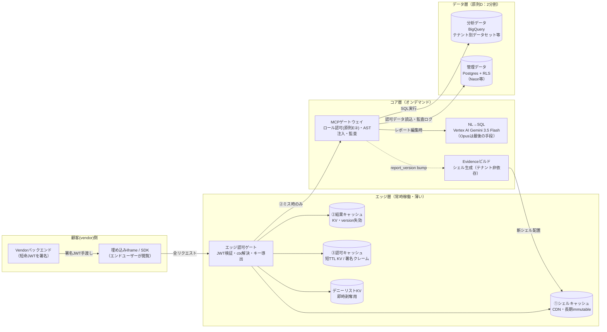
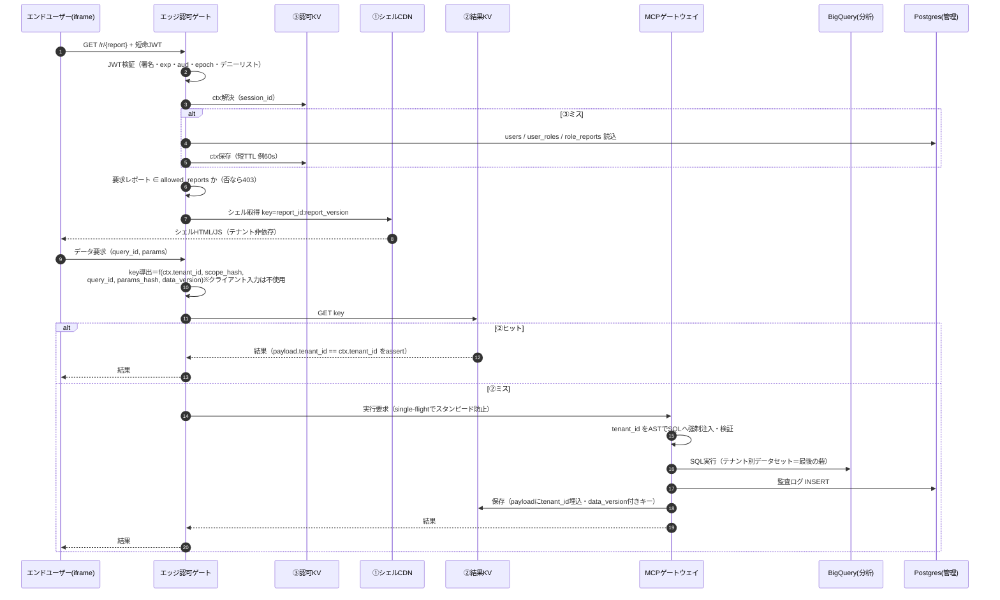
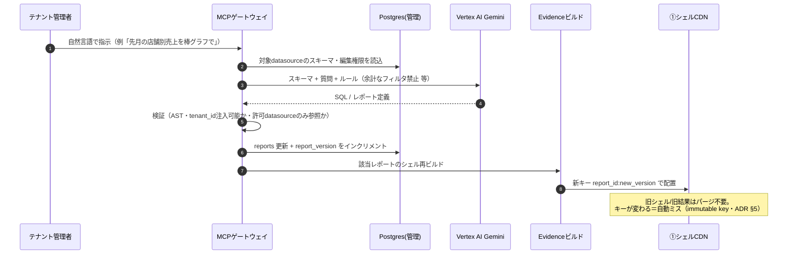
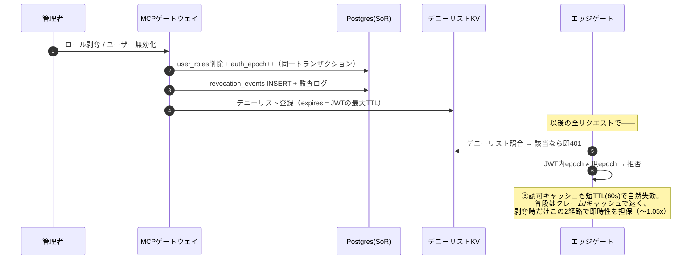
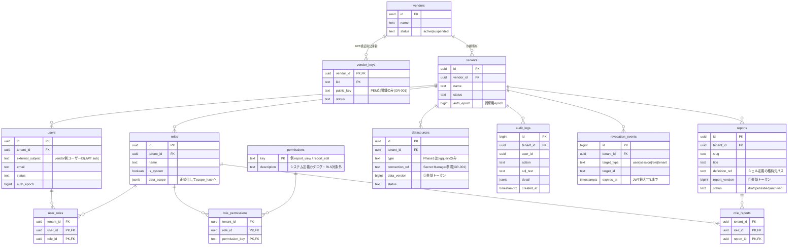

# ChatChart システム設計図集（アーキテクチャ図・シーケンス図・DB設計）

<!--
  Note (repo governance): ADR-0002 requires English for docs/ content. Repository owner
  decision (LOG-0020 pattern, same as requirements.md / ADR-0005): this is an early-stage
  product-discovery document for the Japanese-speaking owner; translate when it graduates
  to implementation-facing documentation.
-->

> **規範（normative）は [ADR-0005](adr/0005-cache-and-authorization-architecture.md)**。
> 本書はADR-0005（原則A〜E）と [requirements.md](requirements.md) を**図とスキーマに展開した派生ドキュメント**であり、
> 矛盾があればADRが勝つ。スキーマは実装前のドラフト（実装時にマイグレーションとして確定する）。

---

## 1. 全体アーキテクチャ図



読み方（ADR-0005との対応）:

- **シェルとデータの分離（原則A）**: ①はテナント非依存のシェルだけ。機密データは②に閉じ、越境の面は「データAPI」だけに封じ込める。
- **2軸のアクセス制御（原則E）**: ①テナント分離＝MCPのAST注入＋データソース側の隔離（BQデータセット/PG RLS）。②ロール認可＝MCPのロジック＋Postgresのロール/権限テーブル。
- **2ストア分割（原則D）**: ゲート/MCPが認可判定に読むのは**Postgres（管理データ）**、クエリが集計するのは**BigQuery（分析データ）**。

---

## 2. シーケンス図

### 2.1 レポート閲覧（キャッシュヒット／ミス両経路）



### 2.2 AIレポート編集（NL→SQL → version bump）



### 2.3 権限剥奪（epoch + デニーリストのハイブリッド）



- **SoRはPostgres**（ADR §9.1・LOG-0029）: 剥奪の遅延はセキュリティ事故なので、真実の置き場は強整合ストア。デニーリストKVは「配信層」であってSoRではない。

---

## 3. DB設計 — 管理データ（Postgres + RLS）

### 3.1 ER図



設計ルール（ADRの原則をスキーマに落としたもの）:

1. **テナント所有テーブルは必ず `tenant_id` カラムを持つ**（結合表 `user_roles` 等も非正規化して持つ）。全テーブルに**同一形のRLSポリシー**を貼るため。
2. **複合FK `(tenant_id, xxx_id)`** で「別テナントのロールを別テナントのユーザーに付ける」類の不整合をDB層で構造的に排除する。
3. `permissions` はシステム定義のグローバルカタログ（テナント非所有・RLS対象外・アプリからは読み取り専用）。**カスタムロール**は `roles`（テナント所有）＋ `role_permissions` の組み合わせで表現する（原則E②）。書き味重視ならここをJSONB化してもよい（ADR §9.1）。
4. 認可コンテキストの導出: `ctx(user) = roles(user_roles) → permissions(role_permissions) ∪ allowed_reports(role_reports) ∪ scope_hash(normalize(∪ data_scope))`。この結果を③キャッシュに置く。SoR（本DB）と配信層（③）を混同しない。
5. 秘密情報は置かない: `vendor_keys` は公開鍵のみ、`datasources.connection_ref` はSecret Manager参照のみ（GR-001）。
6. **製品名を識別子に入れない**（COD-005・LOG-0030）: DBロール・データセット接頭辞・環境変数名などはすべて中立な名前（`app_runtime`, `t_<tenant_slug>` 等）。製品名はMarkdown散文とUI表示にのみ現れる＝改名はgrep置換1回で済む。

### 3.2 スキーマ定義（DDLドラフト）

```sql
-- ============ テナント境界の外（RLS対象外） ============

create table vendors (
  id          uuid primary key default gen_random_uuid(),
  name        text not null,
  status      text not null default 'active'
              check (status in ('active','suspended')),
  created_at  timestamptz not null default now()
);

create table vendor_keys (            -- 埋め込みJWTの検証鍵（公開鍵のみ）
  vendor_id   uuid not null references vendors(id),
  kid         text not null,
  public_key  text not null,
  status      text not null default 'active'
              check (status in ('active','retired')),
  created_at  timestamptz not null default now(),
  primary key (vendor_id, kid)
);

create table permissions (            -- システム定義の権限カタログ
  key         text primary key,       -- 'report:view' | 'report:edit' | ...
  description text not null
);

-- ============ テナント所有（全表にRLS） ============

create table tenants (
  id          uuid primary key default gen_random_uuid(),
  vendor_id   uuid not null references vendors(id),
  name        text not null,
  status      text not null default 'active'
              check (status in ('active','suspended','closed')),
  auth_epoch  bigint not null default 0,
  created_at  timestamptz not null default now()
);

create table users (
  id               uuid primary key default gen_random_uuid(),
  tenant_id        uuid not null references tenants(id),
  external_subject text not null,     -- vendor側ユーザーID（JWTのsub）
  email            text,
  status           text not null default 'active'
                   check (status in ('active','disabled')),
  auth_epoch       bigint not null default 0,
  created_at       timestamptz not null default now(),
  unique (tenant_id, external_subject),
  unique (tenant_id, id)              -- 複合FKの参照先
);

create table roles (
  id          uuid primary key default gen_random_uuid(),
  tenant_id   uuid not null references tenants(id),
  name        text not null,
  is_system   boolean not null default false,
  data_scope  jsonb not null default '{}'::jsonb,  -- 正規化→scope_hash
  created_at  timestamptz not null default now(),
  unique (tenant_id, name),
  unique (tenant_id, id)
);

create table role_permissions (
  tenant_id      uuid not null,
  role_id        uuid not null,
  permission_key text not null references permissions(key),
  primary key (role_id, permission_key),
  foreign key (tenant_id, role_id) references roles (tenant_id, id)
    on delete cascade
);

create table user_roles (
  tenant_id  uuid not null,
  user_id    uuid not null,
  role_id    uuid not null,
  primary key (user_id, role_id),
  foreign key (tenant_id, user_id) references users (tenant_id, id)
    on delete cascade,
  foreign key (tenant_id, role_id) references roles (tenant_id, id)
    on delete cascade
);

create table reports (
  id             uuid primary key default gen_random_uuid(),
  tenant_id      uuid not null references tenants(id),
  slug           text not null,
  title          text not null,
  definition_ref text not null,       -- シェル定義（Evidenceページ/SQL）の格納先
  report_version bigint not null default 1,   -- ①シェル失効トークン（ADR §5）
  status         text not null default 'draft'
                 check (status in ('draft','published','archived')),
  created_at     timestamptz not null default now(),
  updated_at     timestamptz not null default now(),
  unique (tenant_id, slug),
  unique (tenant_id, id)
);

create table role_reports (           -- allowed_reports の実体
  tenant_id  uuid not null,
  role_id    uuid not null,
  report_id  uuid not null,
  primary key (role_id, report_id),
  foreign key (tenant_id, role_id)   references roles   (tenant_id, id)
    on delete cascade,
  foreign key (tenant_id, report_id) references reports (tenant_id, id)
    on delete cascade
);

create table datasources (
  id             uuid primary key default gen_random_uuid(),
  tenant_id      uuid not null references tenants(id),
  type           text not null check (type in ('bigquery')),  -- Phase 1
  connection_ref text not null,       -- Secret Manager参照。資格情報は置かない
  data_version   bigint not null default 0,  -- ②結果失効トークン（ADR §5）
  status         text not null default 'active',
  created_at     timestamptz not null default now()
);

create table audit_logs (             -- 挿入専用
  id         bigint generated always as identity primary key,
  tenant_id  uuid not null references tenants(id),
  user_id    uuid,
  action     text not null,           -- 'query.execute' | 'report.edit' | 'role.revoke' ...
  sql_text   text,
  detail     jsonb not null default '{}'::jsonb,
  created_at timestamptz not null default now()
);

create table revocation_events (      -- デニーリストKVへ流すSoR
  id          bigint generated always as identity primary key,
  tenant_id   uuid not null references tenants(id),
  target_type text not null
              check (target_type in ('user','session','role','tenant')),
  target_id   text not null,
  reason      text,
  expires_at  timestamptz not null,   -- JWTの最大TTLと同じ
  created_at  timestamptz not null default now()
);
```

### 3.3 RLSポリシー（最後の砦・原則C-3）

```sql
-- アプリ接続用ロール（マイグレーション用ownerとは分離する）
create role app_runtime login;      -- パスワードはSecret Manager側で設定

-- テナント所有の全表に同一形のポリシーを貼る
do $$
declare t text;
begin
  foreach t in array array[
    'tenants','users','roles','role_permissions','user_roles',
    'reports','role_reports','datasources','audit_logs','revocation_events'
  ] loop
    execute format('alter table %I enable row level security', t);
    execute format('alter table %I force row level security', t);  -- ownerにも適用
    execute format($p$
      create policy tenant_isolation on %I
        using (%s = current_setting('app.tenant_id')::uuid)
    $p$, t, case when t = 'tenants' then 'id' else 'tenant_id' end);
  end loop;
end $$;
```

- ゲート/MCPはリクエストごとに `set local app.tenant_id = '<検証済みJWT由来のUUID>'` を発行してからクエリする。**アプリ層がWHERE句を書き忘れても、RLSが他テナント行を返さない**——これが「保険」の意味。
- `permissions` / `vendors` / `vendor_keys` はテナント境界の外（システム管理データ）なのでRLS対象外。`app_runtime` には必要最小限のGRANTのみ（`audit_logs` はINSERTのみ等）。

---

## 4. 分析データ（BigQuery）のレイアウト

```
GCPプロジェクト: kotonoha-bi-dev（リネームせず維持）
└─ データセット: t_<tenant_slug>          ← テナント別データセット（第一候補）
     ├─ <業務テーブル群>                    ← ホスト型の場合ここにロード
     └─ （または顧客既存BQへ接続 = connection_refで参照）
```

- テナント分離方式（**未確定・ADR §10-6**）: テナント別データセット vs 行アクセスポリシー vs authorized view。1サービスアカウント多テナント構成では行ポリシー運用がやや厄介で、**データセット分離が最も単純・堅牢な公算**。デザインパートナーのデータ形態を見て確定する。
- 供給元（**未確定・ADR §10-7**）: ChatChartホスト型か、パートナー既存ウェアハウス接続か。どちらでも `datasources` 抽象（§3.2）で表現できる。
- NL→SQLの実行先はここ。精度はspike済み（合成 12/12・実スキーマthelook 12/12、`spikes/nl2sql-*`）。

### 4.1 「Parquet事前エクスポート→Evidenceビルド」パターンとの関係

「中間処理でParquet/CSVをGCS/S3にエクスポートし、それをEvidenceのビルド時データソースとして読み込ませると高速」——これは**単一テナント/社内BIにおけるEvidenceの標準構成**であり、把握したうえで組み替えて採用している:

- **ビルドに焼き込む形は採らない**（原則A）。マルチテナントでは (a) データ更新のたびに**テナント数ぶんのビルド**が必要（コスト・鮮度・ビルド時間が線形に悪化）、(b) テナントデータが静的アセットに入ると**配信面全体が越境面**になる。`spikes/evidence-dynamic` で実証済みのとおり、Evidenceのビルド出力にはプリレンダ結果Arrowとソース Parquet の2データチャネルが含まれ、テキストgrepでは見落としやすい形で機密が焼き込まれる。
- **速さの取り方は同じ思想の分解**: シェル（①）は静的配信そのもの。データ側は「**テナント別に事前集計したParquet/ArrowをGCSに置き、認可ゲート経由で配信**」——これは②結果キャッシュの実装オプションのひとつで、まさにスパイクが検証した経路。固定レポートの閲覧はこれで賄える。
- **実行時BigQueryが要るのはアドホックNL→SQLだけ**。固定レポート＝事前エクスポート（`data_version` 更新と自然に整合）、対話クエリ＝実行時実行、と使い分けられる。

つまり「知らずに外した」のではなく、**認可・テナント分離要件と両立する形に分解して取り込んだ**のが現行設計。どちらの供給形態も `datasources` 抽象と②のキー設計（ADR §4/§5）の中で表現できる。

---

## 5. キャッシュキー（②結果層）— 再掲

規範は ADR-0005 §4。スキーマとの対応だけ示す:

```
key = "v1:" + tenant_id + ":" + scope_hash + ":" + query_id + ":"
            + sha256(params_normalized) + ":" + data_version

  tenant_id    … ③ctx由来（サーバ解決値。クライアント入力は絶対に混ぜない＝原則B）
  scope_hash   … roles.data_scope の正規化ハッシュ（同一スコープのロール間で共有）
  query_id     … reports の定義内クエリID（report_versionに紐づく）
  data_version … datasources.data_version（ETL/書込でインクリメント）
```

---

## 6. 本書が反映している決定

| 決定 | 記録 |
|---|---|
| シェル/データ分離・キー純関数・多層防御 | ADR-0005 原則A〜C |
| データ層2分割（分析=BigQuery / 管理=Postgres+RLS） | 原則D・LOG-0026/0027 |
| テナント分離とロール認可の2軸分離 | 原則E・LOG-0028 |
| role→権限のSoRはPostgres（配信は③キャッシュ） | ADR §9.1・LOG-0029 |
| version token失効（パージレス） | ADR §5 |
| epoch+デニーリストのハイブリッド剥奪 | ADR §3③・requirements |
| NL→SQLはGemini 3.5 Flash既定・Opusは最後の手段 | LOG-0022 |
